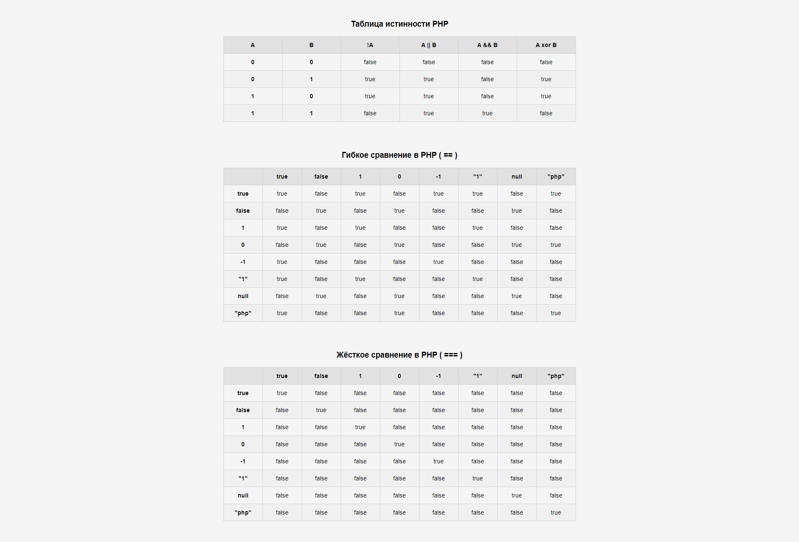

 ## 
Таблица истинности PHP и Таблицы сравнения

 

 ***

- Создан PHP-файл, выведены таблица истинности, таблицы жесткого и гибкого сравнения при помощи HTML, CSS.
- Заполнены результаты операции отрицания.
- Заполнены результаты логических операций И, ИЛИ.
- Заполнены результаты логической операции XOR.
- Заполнены результаты жесткого и гибкого сравнений.
- Сделаны выводы о сравнении в PHP.

***